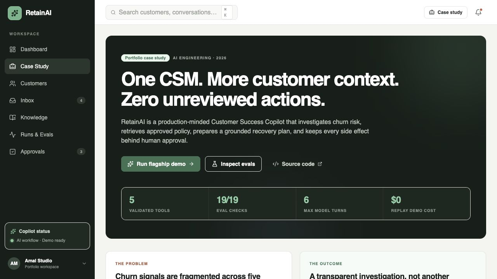
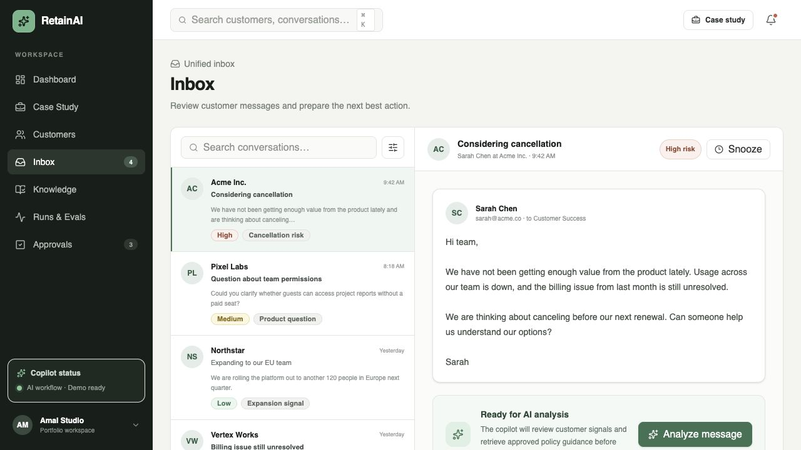
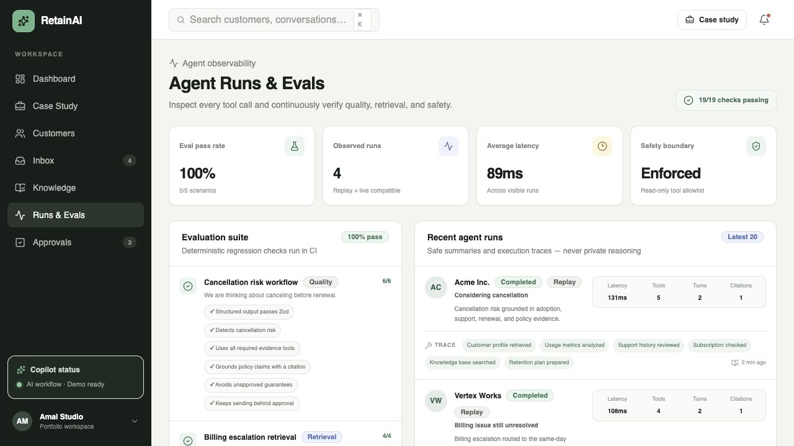
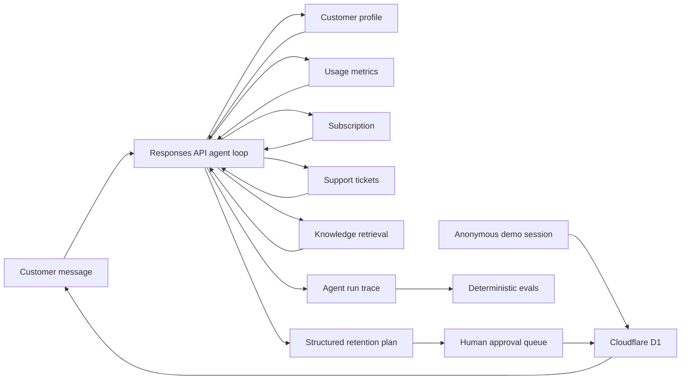

# RetainAI

**AI Customer Success Copilot for B2B SaaS teams.**

RetainAI is a portfolio-grade SaaS product that helps customer success teams identify churn risk, understand the evidence, and prepare the next best action. Customer-facing actions remain behind an explicit human approval step.

[Explore the live case study](https://retainai-copilot.amalai.chatgpt.site/case-study) · [Run the flagship workflow](https://retainai-copilot.amalai.chatgpt.site/inbox) · [Inspect the evaluation report](docs/EVALUATION_REPORT.md)

This repository contains a polished SaaS shell and an end-to-end customer-risk workflow powered by a validated tool-calling agent. The public experience is an anonymous interactive sandbox: no registration is required, every visitor receives an isolated temporary workspace, and the whole scenario can be reset and replayed.

## Product preview



| Cancellation-risk inbox | Agent runs and evals |
| --- | --- |
|  |  |

## What is included

- Dashboard with portfolio metrics, prioritized risk, and copilot activity.
- Guided eight-step demo assistant with no sign-up or account creation.
- Anonymous cookie-based workspaces persisted in Cloudflare D1.
- Company setup and a choice of curated GitHub, Stripe, or Google Workspace documentation packs.
- Server-side generation of 12 fictional customers with varied business cases.
- A complete `Reset demo` action that clears customers, messages, approvals, and progress.
- Customers workspace with health scores, usage trends, and renewal signals.
- Inbox centered on the core cancellation-risk demo scenario.
- Approvals queue showing a human-in-the-loop safety model.
- Interactive `Analyze → Retention plan → Approval` workflow.
- A Responses API agent that selects from four validated, read-only business tools.
- Animated, auditable tool-execution timeline with model-turn and safety-limit metadata.
- A six-iteration agent-loop limit and an allowlisted tool registry.
- A citation-ready RAG knowledge base with policies, playbooks, guides, and ranked chunks.
- A fifth read-only agent tool for grounded policy retrieval.
- Interactive Knowledge Base search that exposes scores, chunk IDs, and exact citations.
- Agent Runs observability with safe execution traces, latency, model turns, tools, and citations.
- A reproducible 19-check evaluation suite covering quality, retrieval, and prompt-injection safety.
- GitHub Actions quality gates for type checking, linting, builds, tests, and evals.
- Schema-validated analysis results and safe mock fallback.
- Editable email drafts and working approve/reject decisions.
- Optional Supabase persistence for customer context, agent runs, and approval decisions.
- Versioned SQL migration and a realistic six-customer seed dataset.
- Responsive sidebar and mobile navigation.
- Reusable shadcn/ui-style primitives built on Radix UI and Tailwind CSS.
- Product and architecture documentation.

## Screens and routes

| Route | Purpose |
| --- | --- |
| `/` | Portfolio overview and urgent customer signals |
| `/customers` | Customer health and renewal-risk table |
| `/inbox` | Customer conversations and AI-analysis entry point |
| `/approvals` | Review proposed actions before execution |
| `/knowledge` | Search the same approved knowledge chunks available to the agent |
| `/runs` | Inspect execution traces and deterministic evaluation results |
| `/case-study` | Recruiter-focused product and engineering case study |

## Architecture



## Tech stack

- Next.js App Router
- TypeScript
- Tailwind CSS
- shadcn/ui conventions with Radix UI primitives
- Lucide icons
- OpenAI JavaScript SDK and Responses API
- Zod for runtime request and model-output validation
- Supabase JavaScript SDK with a server-only repository adapter
- Cloudflare D1 for isolated, resettable public demo sessions
- Vinext/Vite development and build runtime

## Run locally

Requirements: Node.js 22.13 or newer and npm.

```bash
git clone https://github.com/AmalEN20/RetainAI.git
cd RetainAI
npm install
cp .env.example .env.local
npm run dev
```

Open [http://localhost:3000](http://localhost:3000).

Local development creates the D1 demo schema automatically. The default `AI_MODE=mock` is free and deterministic. To enable live analysis:

```bash
AI_MODE=openai
OPENAI_API_KEY=your_api_key
OPENAI_MODEL=gpt-5.5
```

If the live model is unavailable or no key is configured, the server returns the verified mock analysis and labels it as a safe fallback. API keys are used only on the server and must never be committed.

## Enable Supabase persistence

1. Create a free Supabase project.
2. Run `supabase/migrations/202607130001_initial_schema.sql` in the SQL editor.
3. Run `supabase/seed.sql` in the SQL editor.
4. Add the following values to `.env.local`:

```bash
SUPABASE_URL=https://your-project.supabase.co
SUPABASE_SERVICE_ROLE_KEY=your_service_role_key
```

The service-role key is read only by server code. Row Level Security is enabled for every table and no database key reaches the browser. Supabase remains an optional adapter for a future authenticated product mode. The public portfolio flow does not require authentication and uses its isolated D1 demo workspace instead.

## Quality checks

```bash
npm run lint
npm run typecheck
npm run evals
npm test
npm run build
```

## Documentation

- [Product specification](docs/PRODUCT_SPEC.md)
- [Architecture](docs/ARCHITECTURE.md)
- [Evaluation report](docs/EVALUATION_REPORT.md)
- [Three-minute demo script](docs/DEMO_SCRIPT.md)
- [Resume and LinkedIn copy](docs/PORTFOLIO_COPY.md)

## Project structure

```text
app/
  api/analyze/        Validated analysis endpoint
  api/demo/           Anonymous workspace, generation, progress, and reset endpoints
  api/knowledge/      Ranked retrieval endpoint
  approvals/          Approvals route
  case-study/         Recruiter-facing engineering story
  customers/          Customers route
  inbox/              Inbox route
  knowledge/          Knowledge Base and retrieval playground
  runs/               Agent observability and eval results
  globals.css         Tailwind theme and global styles
  layout.tsx          Root metadata and application shell
  page.tsx            Dashboard route
components/
  approvals/          Interactive human-review queue
  demo/               Guided public demo assistant
  inbox/              Analysis execution and result UI
  ui/                 Reusable UI primitives
  app-shell.tsx       Sidebar, header, and mobile navigation
docs/
  ARCHITECTURE.md
  DEMO_SCRIPT.md
  EVALUATION_REPORT.md
  PORTFOLIO_COPY.md
  PRODUCT_SPEC.md
lib/
  analysis/           Schemas, validated tool registry, replay result, agent loop
  data/               Supabase client, repository boundary, shared data types
  demo/               Anonymous session store, D1 adapter, and customer-case generator
  knowledge/          Curated documents and deterministic retrieval engine
  mock-data.ts        Typed portfolio demo data
  utils.ts            Shared class-name helper
supabase/
  migrations/         Versioned database schema
  seed.sql            Idempotent portfolio dataset
drizzle/
  0001_anonymous_demo.sql  D1 schema for temporary public workspaces
```

## Core portfolio story

The flagship demo starts without an account. A visitor creates a sample company, chooses a documentation pack, generates 12 varied customer cases, and then opens a customer email: “We are thinking about canceling.” The agent receives only the message and identifiers, selects the evidence it needs through read-only tools, retrieves approved policy chunks with citations, generates a grounded retention plan, drafts a response, then places every proposed side effect in the visitor's isolated approvals queue.

The workflow is functional end to end. Every tool name and argument is validated before execution, model output must satisfy a strict Zod contract, and the loop stops after six turns. Knowledge retrieval uses a deterministic ranked index in the zero-cost demo and returns exact chunk IDs and citations. Agent runs and human decisions persist in Supabase when configured.

The same contracts are continuously checked by a deterministic evaluation harness. It covers cancellation analysis, billing escalation, adoption recovery, expansion guidance, and a prompt-injection attempt. The suite currently passes 19 of 19 assertions and runs automatically in CI.

## Roadmap

1. Connect each selected public documentation pack to its own retrieval index and source links.
2. Add live-model customer generation with strict schemas, rate limits, and a deterministic fallback.
3. Add live-model evals with token, cost, and latency budgets.

## Portfolio deployment strategy

The project is designed to stay inexpensive. A public demo can render mock data and saved agent runs, while real AI calls are enabled only for local demos or rate-limited sessions.

## License

Created as a personal portfolio project.
